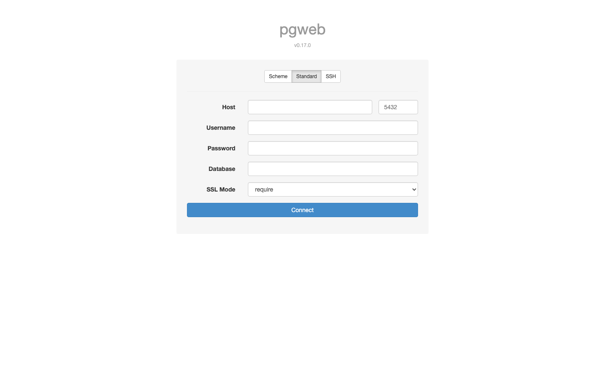

Nexlayer.com
#54 https://github.com/armondhonore/pgweb

LIVE URL: https://relaxed-weasel-pgweb.cloud.nexlayer.ai

A clean web GUI for PostgreSQL in a single 20MB Go binary. pgweb gives you query editing, schema browsing, and CSV export from the browser — point it at any Postgres and go. No install, no Electron, just one tiny pod.

#250apps #nexlayer #postgres #golang #opensource

